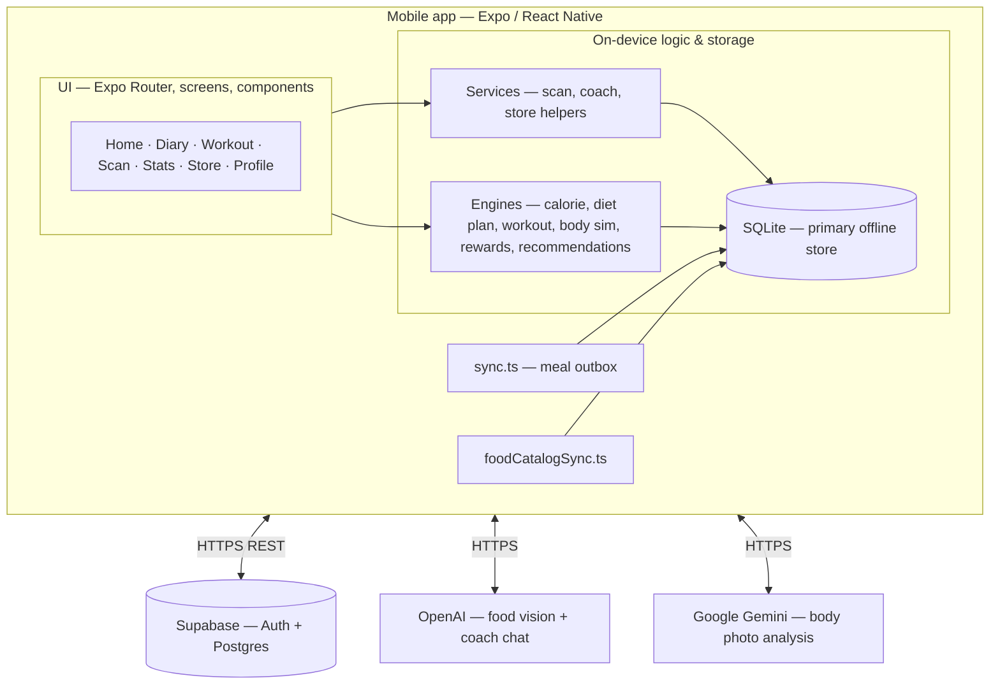
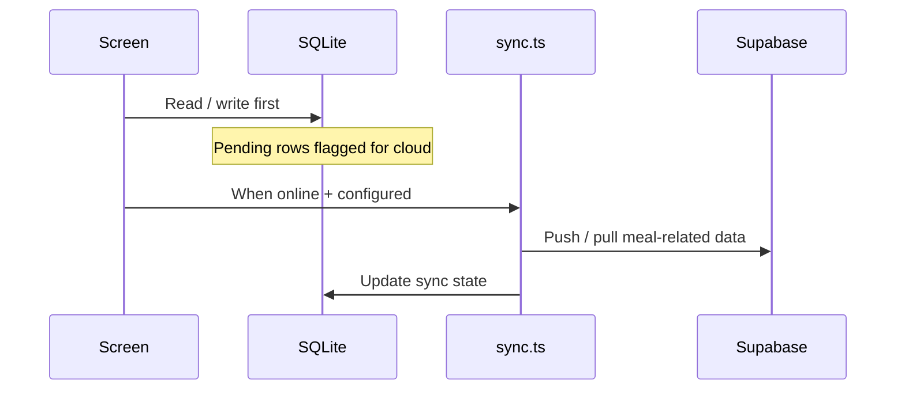

# Evolve — User Guide

**Evolve: The AI Body Architect** is a cross-platform wellness app (Expo / React Native). This guide explains how to install it, configure optional cloud features, and use each major screen.

---

## 1. What Evolve does

- **Health profile** — Multi-step onboarding captures your basics, routine, diet, health flags, lifestyle, goals, and optional body measurements (waist, hip, neck, wrist).
- **Calorie & macro tracking** — Log meals manually or use the **food scanner** (AI interprets a photo and suggests nutrition).
- **Personal targets** — Daily calorie goals and macro-oriented meal ideas are derived from your profile using built-in nutrition logic.
- **Workouts** — Weekly workout plans you can start and mark complete; streaks tie into rewards.
- **Analytics** — Charts and summaries of intake and progress.
- **Body insights & simulation** — Somatotype-style summary and a milestone-style body journey visualisation (illustrative, not medical).
- **Evolve Coach** — Chat-style motivational support (uses AI when configured; otherwise supportive template replies).
- **Fit Store** — In-app shop for fitness-related products (cart, checkout flows).
- **Offline-first diary** — Core data is stored on your device (SQLite). Optional sync to **Supabase** when configured.
- **Architecture (developers)** — As-built high-level diagram and notes vs older conceptual drawings: **§21**.

**Important:** Evolve is a **wellness / prototype** tool. It is **not** a medical device and does **not** replace advice from doctors, dietitians, or mental health professionals.

---

## 2. Requirements

| Item | Details |
|------|---------|
| **Devices** | Phone or tablet — **iOS** or **Android** (Expo Go), or **web** (limited; optimised for narrow layout). |
| **OS** | Recent iOS or Android version capable of running **Expo Go** from the App Store / Play Store. |
| **Network** | **Wi‑Fi or mobile data** recommended for **sign-up**, **food scan**, **AI coach**, and **cloud sync**. The diary can work offline once data is local. |
| **Permissions** | **Camera** (food scan), optional **photo library** (pick images). |
| **Accounts** | Email-based account when using Supabase authentication (see development setup). |

---

## 3. Getting the app (two ways)

### Option A — Demonstration with Expo Go (typical for coursework)

1. Install **Expo Go** on your phone ([iOS](https://apps.apple.com/app/expo-go/id982107779) / [Android](https://play.google.com/store/apps/details?id=host.exp.exponent)).
2. On your PC, from the `calorie-tracker` folder run `npm install` then `npx expo start`.
3. Scan the **QR code** from the terminal or Dev Tools page with Expo Go (Android: Expo Go scanner; iOS: Camera app may open Expo Go).

### Option B — Development / production build

For native modules or store submission, use **Expo EAS Build** (see [Expo docs](https://docs.expo.dev/build/introduction/)). This guide assumes Expo Go unless stated otherwise.

---

## 4. Optional configuration (developers / demo hosts)

Create a `.env` file in `calorie-tracker` (or set variables in your Expo environment) **only if** you want live cloud features:

| Variable | Purpose |
|----------|---------|
| `EXPO_PUBLIC_OPENAI_KEY` | Enables **real** food scan (GPT‑4o Vision) and **full** Evolve Coach replies (GPT‑4o-mini). If missing, scan uses **demo** results and coach uses **offline templates**. |
| `EXPO_PUBLIC_SUPABASE_URL` | Supabase project URL for auth / remote tables. |
| `EXPO_PUBLIC_SUPABASE_ANON_KEY` | Supabase anon key (still respect RLS; never ship service keys in client builds for production). |
| `EXPO_PUBLIC_GEMINI_API_KEY` | Optional — **body photo analysis** features that call Gemini (separate from meal scanning). |

Restart Expo after changing env vars.

**Security note:** For real deployments, API keys should be kept on a **backend**, not only in the mobile app. Course demos often use `.env` for practicality.

---

## 5. First-time launch — step by step

### 5.1 Welcome carousel (3 screens)

When you open Evolve for the first time you see three introductory pages (swipe horizontally):

1. **Track Calories** — Diary and dashboard overview.  
2. **Scan Your Food** — Camera-based logging.  
3. **Achieve Goals** — Targets, streaks, analytics.

Tap **Get Started** to continue.

**Shortcut:** If you already use Evolve on another device and only need to sign in, use **Already have an account?** (if shown) to go to **Login**.

### 5.2 Health profile setup (multi-step)

After the welcome flow you enter **Profile Setup** — a guided questionnaire saved locally as you go. The steps cover:

1. **Basics** — Biological gender, age, height, weight, etc.  
2. **Routine** — Activity level, work type, sleep, commute, exercise frequency.  
3. **Diet** — Diet type, meals per day, snacks, water, allergies, cuisine preferences.  
4. **Health** — Blood sugar / cholesterol flags, conditions, medications, family history, smoking, alcohol.  
5. **Lifestyle** — Stress, marital status, pregnancy where relevant, etc.  
6. **Thoughts** — Short free-text notes about your journey.  
7. **Dream goals** — Target weight, fitness level aspirations, dream habits / routine.  
8. **Measurements** *(optional but recommended)* — Waist, hip, neck, wrist for richer body-composition estimates.  
9. **Review** — Confirm and finish.

Use **Back** / **Next** (or equivalent controls) to move between substeps. Your answers drive calorie targets, meal ideas, workouts, and profile insights.

### 5.3 Account creation or login

After profile setup:

- If you are **new**, you are directed to **Register** with email and password (when Supabase auth is enabled).  
- After registration you may need **email verification** depending on project settings — check **Verify Email** instructions on screen.

Once verified (or if verification is disabled), you reach the **main app** (tabs).

### 5.4 Returning users

If the device already completed onboarding, the app opens **Login** when you are signed out. After sign-in you land on **Home**.

---

## 6. Main navigation (bottom tabs)

| Tab | Name | Role |
|-----|------|------|
| Left | **Home** | Dashboard: calorie ring, macros, today’s meals, workout preview, diet preview, shortcuts. |
| | **Diary** | Day-by-day meal log and food history. |
| | **Workout** | Weekly plan and session tracking. |
| Centre | **Scan** *(FAB)* | Camera / gallery food scanner. |
| | **Stats** | Analytics charts and summaries. |
| | **Store** | Fit Store catalogue and cart. |
| Right | **Profile** | Your account, body insights, edit profile, coach entry, settings. |

Some screens (e.g. **Coach**, **Diet plan**, **Body simulation**) open from **Home** or **Profile** and do not always appear as separate tab icons.

---

## 7. Home dashboard

- **Calorie ring / progress** — Compares today’s logged calories to your personalised daily goal.  
- **Macros** — Protein, carbs, fat summaries for the day.  
- **Today’s meals** — Quick view of what you logged.  
- **Workout preview** — Today’s planned session when a weekly plan exists.  
- **Body simulation preview** — Tap through to the full timeline experience.  
- **Diet plan preview** — Shortcut to today’s suggested meals.  
- **Quick add** — Fast path to add a meal.

Pull to refresh if totals look stale after logging elsewhere.

---

## 8. Diary & adding meals

### 8.1 Open Diary tab

Browse dates and see meals grouped by type (**Breakfast**, **Lunch**, **Dinner**, **Snack**).

### 8.2 Add a meal

Use **Add meal** / **+** (from Home or Diary paths):

- **Manual search** — Find foods in the local database; adjust servings; save.  
- **Scan** — Jump to scanner flow (see §9).

Saved meals update daily totals and analytics.

---

## 9. Food scanner (centre button)

1. Allow **camera** permission when prompted.  
2. **Capture** a meal photo or **choose from gallery**.  
3. Wait for analysis:

   - **With `EXPO_PUBLIC_OPENAI_KEY`:** The app sends the image to OpenAI and shows dish name, calories, macros, confidence, and alternatives.  
   - **Without API key:** You get **demo** sample foods so you can still demonstrate the flow.

4. Review the result — edit meal type (breakfast/lunch/dinner/snack) if needed.  
5. **Confirm** to save to your diary.

**Tips**

- Good lighting and a clear plate improve results.  
- Very mixed platters may still be imperfect — use manual adjustment or manual logging if needed.

---

## 10. Workout tab

- View your **weekly workout plan** generated from your health profile.  
- Open **today’s session**, follow exercises, and **mark complete** where supported.  
- Completing sessions contributes to **streaks** and **rewards** (XP / levels).

Some flows open **Exercise tutorial** or dedicated **Workout session** screens with richer detail.

---

## 11. Stats (Analytics)

Visual summaries of calories and macros over time — useful for spotting trends. Exact charts depend on how much you log.

---

## 12. Store tab

- Browse **Fit Store** products (equipment, supplements-themed items, accessories — product mix is demo/content-driven).  
- Add items to **cart**, review **checkout** screens, and explore **wishlist** / **orders** where implemented.

Purchases in coursework builds are typically **non-production**; treat payment flows as demonstrations unless wired to a live gateway.

---

## 13. Profile tab

Typical contents:

- **Avatar / identity** — Linked to your signed-in user when using Supabase.  
- **Health summary** — Links to **Body insights** (somatotype-style breakdown from your onboarding measurements and signals).  
- **Edit health profile** — Update onboarding fields later (weight, goals, measurements, etc.).  
- **Evolve Coach** — Opens the mindset coach chat (see §14).  
- **Body simulation** — Full milestone journey view.  
- **Settings** — Language, units, notifications, privacy/terms, etc.

### Body insights

Shows interpreted **body-type blend**, estimated body-fat band when measurements allow, and tips. Treat outputs as **wellness estimates**, not clinical diagnoses.

---

## 14. Evolve Coach (mindset chat)

- Ask for encouragement, habit tips, or help getting back on track after setbacks.  
- **With OpenAI key:** Replies adapt to your wording and light context (e.g. recent workout streak summaries from local data).  
- **Without key:** You receive rotating **supportive template** messages so the feature still works offline-first.

**Crisis safety:** If you mention serious self-harm or suicide-related wording, the app shows a **fixed crisis message** and does **not** send that content to the AI model. **Contact local emergency services or a crisis line** if you are in danger.

---

## 15. Diet plan screen

Opens from Home shortcuts. Shows **today’s structured meal suggestions** (titles, descriptions, calories/macros) aligned with your targets and preferences — generated by in-app rules, not arbitrary free text.

---

## 16. Offline use & sync

- **Diary, profile, workouts, coach templates** work from the **local SQLite** database when offline.  
- **Food scan** and **live AI coach** need **network** (except demo scan mode).  
- If Supabase is configured, `sync` pushes pending meal entries when connectivity returns. If Supabase is **not** configured, the app remains fully local for diary features.

---

## 17. Settings (common options)

Paths: **Profile → Settings** (stack).

May include:

- **Units** — e.g. metric/imperial where implemented.  
- **Notifications** — reminder preferences.  
- **Language** — locale-oriented labels where wired.  
- **Privacy / Terms** — project legal placeholders; read before real-use deployments.

---

## 18. Troubleshooting

| Issue | What to try |
|------|-------------|
| **Stuck on Loading** | Ensure first launch finished DB init; force-close Expo Go and reopen. |
| **Scan always shows random demo foods** | Set `EXPO_PUBLIC_OPENAI_KEY` correctly and restart Expo; check key starts with `sk-`. |
| **Coach replies mention offline mode** | Missing OpenAI key — expected; add key for full AI replies. |
| **Cannot sign in** | Confirm Supabase URL/key and that email verification completed. |
| **Data missing on new phone** | Local SQLite is **per device** unless restored via sync/backend migration. |
| **Camera black screen** | Grant permission in system Settings; restart app. |

---

## 19. Glossary

| Term | Meaning |
|------|---------|
| **Macro** | Protein, carbohydrates, fat. |
| **TDEE / calorie goal** | Daily energy target estimated from profile + activity signals in-app. |
| **Demo scan** | Deterministic sample scan when no AI key is present. |
| **SQLite** | On-device database storing your logs. |
| **Supabase** | Optional cloud backend for auth and synced tables. |

---

## 20. Support & project info

- **Source:** `calorie-tracker` repository (Expo app).  
- **Run locally:** `npm install` → `npx expo start`.  
- **AI training (ViT):** See `model/README.md` for Food‑101 pipeline (separate from the in-app meal scanner API path).

---

## 21. High-level architecture (v1, as-built)

This matches the **shipped** `calorie-tracker` code: one mobile client talking to Supabase and to third-party APIs. There is **no** standalone backend service or microservice tier in the repo.

### 21.1 System diagram (Mermaid)

### 21.2 Data flow (offline-first)

### 21.3 If you have an older “conceptual” diagram, align it like this

| Older label | v1 truth in this codebase |
|-------------|---------------------------|
| MediaPipe pose detection | **Not present** in app source (workouts are rule/UI-driven). Remove or mark *planned*. |
| Payment gateway API | **Demo only** — orders stay local; no Stripe/PayPal integration. |
| Supabase Storage for all camera uploads | **Not used** in source; images go to APIs (base64) or local URIs as implemented per feature. |
| “Microservices” AI: metabolic risk + dynamic recommendations | **In-app TypeScript** (`dietPlanEngine`, `calorieEngine`, `recommendationService`, `bodyTypeEngine`, etc.), not separate cloud services. |
| OpenAI vision + chat motivator | **Correct** — `scan.service.ts`, `coach.service.ts`. |
| Gemini | **Add** for body photo flow — `bodyPhotoAnalysis.ts`. |
| Supabase Auth + Postgres + SQLite | **Correct** — optional cloud; local-first diary. |

### 21.4 Production note

LLM and Gemini keys are read from `EXPO_PUBLIC_*` for coursework demos. For real releases, **proxy** those calls through a backend so secrets are not embedded in the client.

### 21.5 Minimal redraw checklist (honest v1, keep the story)

Use this when updating a **three-column** diagram (AI / client / backend). Goal: boxes and arrows match the **shipped** app, while still showing a compelling product story.

#### Column titles

| Was (conceptual) | Use (v1 shipped) |
|------------------|------------------|
| AI, API & Microservices | **AI & external APIs** (calls originate in the **mobile app**; there is no separate Evolve microservice layer in-repo) |
| Client Layer — React Native / Expo | **Client — Expo / React Native** (unchanged; optionally subtitle: *offline-first*) |
| Backend & Database — Supabase | **Cloud — Supabase** (Auth + Postgres; optional for diary) |

#### Remove or do not draw as live integrations

- **MediaPipe pose detection** — not implemented in app source; delete the box or move to a grey “Future / roadmap” lane.
- **Dedicated “Payment Gateway API”** cloud box with a live arrow — there is no Stripe/PayPal (or similar) integration; checkout is **demo** (local order record + UI). Replace with a **client-side** note or a dashed “future payment provider” stub if you need it for narrative.
- **Supabase Storage** as the default path for **all** camera uploads — not used in current source for that role; remove the solid arrow “camera → Storage → …” unless you implement it later.
- **Separate cloud boxes** for **Metabolic Intelligence & Risk Analyzer** and **Dynamic Recommendation Engine** as if they were hosted services — they are **not** deployed services; see “Rename / merge” below.

#### Rename / merge (same story, accurate placement)

- **“Expo SQLite Cache”** → **“Expo SQLite (primary store)”** — it is the main on-device database, not only a cache.
- **Metabolic / risk + dynamic recommendations** → one **client** box, e.g. **“On-device engines”** or **“Planning & personalization (local)”** with a short sub-line: *calorie targets, diet plan, workouts, body-type / insights, store fit, risk-aware diet tweaks* (implemented in `calorieEngine`, `dietPlanEngine`, `workoutEngine`, `bodyTypeEngine`, `recommendationService`, etc.).
- **“Interactive Workout … MediaPipe”** → **“Workouts & sessions (plans + logging)”** — keeps the fitness story without claiming pose tracking.

#### Add

- **Google Gemini** (body photo → structured insights) — pair with **`EXPO_PUBLIC_GEMINI_API_KEY`** in a small note if the diagram is for developers.
- Optional **single arrow** from app to Gemini: *body image / analyse* (parallel to OpenAI for meal photos).

#### Keep (already true)

- **OpenAI** for **meal image → food / calorie JSON** (with demo mode when no key).
- **OpenAI** for **Evolve Coach / chat** (with template fallback when no key).
- **Supabase Auth** for sign-in when configured.
- **PostgreSQL (Supabase)** for synced tables + **food catalog** pull; **sync** / **outbox** pattern from SQLite.
- **Expo Camera / gallery** → **send image to OpenAI** (food) and **Gemini** (body), not only to “the backend”.
- **Visualization** (3D / body UI) as **on-device** rendering if you show it — stays in the client column.

#### Suggested boxes per column (copy-paste labels)

**Column A — AI & external APIs**

1. OpenAI — meal vision (GPT‑4o class) → JSON macros  
2. OpenAI — coach chat (LLM)  
3. Google Gemini — body photo analysis  

**Column B — Client (Expo)**

1. UI & onboarding (Expo Router)  
2. Expo Camera / image picker  
3. On-device engines (calories, diet, workouts, recommendations, body insights)  
4. SQLite — diary, catalog cache, store/products local data  
5. Visualization (charts, 3D / body views)  
6. Fit Store UI — cart / checkout **(demo orders)**

**Column C — Cloud (Supabase)**

1. Auth  
2. Postgres + RLS (profiles, logs, meals sync, `food_items`, etc. — match your actual schema in dashboards)  
3. *(Optional dashed)* Storage / payment / MediaPipe — only if labeled *not in v1*

#### Arrows to show (high level)

- Camera → **OpenAI** (meal scan); Camera / gallery → **Gemini** (body analysis).  
- Client ↔ **Supabase**: auth; sync user data & logs; optional catalog fetch.  
- **Do not** draw a solid arrow from client → external payment API unless you wire a real provider.  
- Internal: all **engines** and **SQLite** stay **inside** the client column (no separate “microservice” boxes for them).

---

*Last updated to match the Evolve calorie-tracker codebase structure (tabs, auth flow, profile-setup steps, env-driven features, and §21 as-built architecture).*
