# 5.2 Class Diagram — Calorie Tracker App

> **Note:** The app is built in TypeScript/React Native (functional, not class-based OOP).
> The diagram maps **interfaces → classes**, **modules → service classes**, and **screen components → controller classes**, following standard UML conventions for report purposes.

---

## Full Class Diagram

```mermaid
classDiagram

    %% ══════════════════════════════════════════════════════
    %% DOMAIN MODEL — Core Data Types
    %% ══════════════════════════════════════════════════════

    class UserProfile {
        +String id
        +String display_name
        +String avatar_url
        +Number daily_calorie_goal
        +Number height_cm
        +Number weight_kg
        +Number age
        +Gender gender
        +ActivityLevel activity_level
        +String created_at
        +String updated_at
    }

    class FoodItem {
        +String id
        +String name
        +String brand
        +Number serving_size
        +String serving_unit
        +Number calories
        +Number protein_g
        +Number carbs_g
        +Number fat_g
        +Number fiber_g
        +String barcode
        +Boolean is_verified
    }

    class MealEntry {
        +String id
        +String user_id
        +String food_item_id
        +String food_name
        +MealType meal_type
        +Number servings
        +Number calories
        +Number protein_g
        +Number carbs_g
        +Number fat_g
        +String logged_at
        +String notes
        +Boolean is_deleted
        +SyncStatus sync_status
    }

    class DailyLog {
        +String id
        +String user_id
        +String log_date
        +Number total_calories
        +Number total_protein_g
        +Number total_carbs_g
        +Number total_fat_g
        +Number water_ml
    }

    class OnboardingProfile {
        +String user_id
        +BiologicalGender biological_gender
        +GenderIdentity gender_identity
        +Number age
        +Number height_cm
        +Number weight_kg
        +ActivityLevel activity_level
        +WorkType work_type
        +String wake_time
        +String sleep_time
        +DietType diet_type
        +Number meals_per_day
        +SnackingHabit snacking_habit
        +HealthLevel blood_sugar_level
        +HealthLevel cholesterol_level
        +SmokingStatus smoking_status
        +Number sleep_hours
        +StressLevel stress_level
        +Number waist_cm
        +Number hip_cm
        +Number neck_cm
        +Number wrist_cm
        +Number dream_weight_kg
        +FitnessLevel dream_fitness_level
    }

    class BodyTypeResult {
        +BodyType dominant
        +String blend
        +Number ecto
        +Number meso
        +Number endo
        +Number estimatedBF
        +FrameSize frameSize
        +String confidence
        +String[] insights
    }

    class FoodRecognitionResponse {
        +String food_name
        +Number confidence
        +Number calories_per_serving
        +Number serving_size
        +String serving_unit
        +Number protein_g
        +Number carbs_g
        +Number fat_g
        +Array alternatives
    }

    class NutritionSummary {
        +Number calories
        +Number protein_g
        +Number carbs_g
        +Number fat_g
        +Number goal
        +Number remaining
        +Number percentage
    }

    class MealGroup {
        +MealType type
        +String label
        +String icon
        +MealEntry[] entries
        +Number totalCalories
    }

    %% ══════════════════════════════════════════════════════
    %% SERVICE LAYER
    %% ══════════════════════════════════════════════════════

    class DatabaseService {
        <<service>>
        -SQLiteDatabase db
        +initDatabase() void
        +saveOnboardingProfile(userId, data) void
        +getOnboardingProfile(userId) OnboardingProfile
        +saveBodyTypeResult(userId, result) void
        +getBodyTypeResult(userId) BodyTypeResult
        +getMealEntriesByDate(userId, date) MealEntry[]
        +addMealEntry(entry) void
        +updateMealEntry(id, data) void
        +softDeleteMealEntry(id) void
        +restoreMealEntry(id) void
        +getDailyLog(userId, date) DailyLog
        +searchFoodItems(query) FoodItem[]
    }

    class BodyTypeEngine {
        <<service>>
        +detectBodyType(profile) BodyTypeResult
        -structuralScore(height, weight) Scores
        -compositionScore(h, waist, hip, neck, wrist, isFemale) Scores
        -lifestyleScore(profile) Scores
        -metabolicScore(profile) Scores
        -genderCorrect(scores, isFemale) Scores
        -normalise(ecto, meso, endo) Scores
        -buildInsights(result, profile) String[]
    }

    class ScanService {
        <<service>>
        -String HF_API_URL
        -String HF_API_TOKEN
        +recognizeFood(base64Image) FoodRecognitionResponse
        +prepareImageForScan(uri) String
        +getDemoResult() FoodRecognitionResponse
        -mapHFResultToResponse(results) FoodRecognitionResponse
        -isHFConfigured() Boolean
    }

    class SyncService {
        <<service>>
        +syncAll() SyncResult
        -pushMealEntries() void
        -pullRemoteChanges() void
        +getSyncStatus() SyncStatus
        -getUnsyncedMealEntries() MealEntry[]
        -markMealEntrySynced(id) void
    }

    class AuthContext {
        <<context>>
        +User user
        +Boolean loading
        +signIn(email, password) void
        +signUp(email, password) void
        +signOut() void
    }

    %% ══════════════════════════════════════════════════════
    %% SCREEN / COMPONENT LAYER
    %% ══════════════════════════════════════════════════════

    class ProfileSetupScreen {
        <<screen>>
        -Number step
        -Number TOTAL_STEPS = 9
        -String bioGender
        -Number age
        -Number heightCm
        -Number weightKg
        -String activityLevel
        -String dietType
        -Number waistCm
        -Number hipCm
        -Number neckCm
        -Number wristCm
        -Boolean isEditMode
        +handleFinish() void
        +goNext() void
        +goBack() void
        +jumpTo(step) void
        -loadExistingProfile() void
    }

    class DiaryScreen {
        <<screen>>
        -MealEntry[] entries
        -String selectedDate
        -Number calorieGoal
        -MealEntry undoEntry
        +loadEntries(date) void
        +handleDelete(entry) void
        +handleUndo() void
        +handleRestore(entry) void
        -computeTotals() NutritionSummary
    }

    class ScanScreen {
        <<screen>>
        -CameraRef cameraRef
        -FoodRecognitionResponse scanResult
        -Boolean isProcessing
        +handleCapture() void
        +handlePickImage() void
        +handleAddToLog(result) void
    }

    class ProfileScreen {
        <<screen>>
        -BodyTypeResult bodyTypeResult
        -Number calorieGoal
        -Boolean isSyncing
        +handleSync() void
        +handleSignOut() void
        -loadBodyType() void
    }

    class BodyInsightsScreen {
        <<screen>>
        -BodyTypeResult result
        -OnboardingProfile profile
        -Boolean loading
        -Animated ectoAnim
        -Animated mesoAnim
        -Animated endoAnim
        -animateBars(result) void
    }

    class AddMealScreen {
        <<screen>>
        -FoodItem[] searchResults
        -String query
        -FoodItem selectedFood
        -Number servings
        +searchFood(query) void
        +addToLog(food, servings, mealType) void
    }

    %% ══════════════════════════════════════════════════════
    %% RELATIONSHIPS
    %% ══════════════════════════════════════════════════════

    %% Composition / Aggregation
    MealGroup "1" *-- "many" MealEntry : contains
    DailyLog "1" --> "many" MealEntry : aggregates
    MealEntry "many" --> "1" FoodItem : references
    MealEntry "many" --> "1" UserProfile : belongs to
    OnboardingProfile "1" --> "1" UserProfile : extends
    BodyTypeResult "1" --> "1" OnboardingProfile : derived from

    %% Service dependencies
    DatabaseService ..> OnboardingProfile : stores/retrieves
    DatabaseService ..> MealEntry : stores/retrieves
    DatabaseService ..> DailyLog : stores/retrieves
    DatabaseService ..> BodyTypeResult : caches
    BodyTypeEngine ..> OnboardingProfile : reads
    BodyTypeEngine ..> BodyTypeResult : produces
    ScanService ..> FoodRecognitionResponse : produces
    SyncService ..> MealEntry : syncs
    SyncService ..> DatabaseService : uses

    %% Screen dependencies
    ProfileSetupScreen ..> DatabaseService : calls
    ProfileSetupScreen ..> OnboardingProfile : populates
    DiaryScreen ..> DatabaseService : calls
    DiaryScreen ..> MealEntry : displays
    DiaryScreen ..> NutritionSummary : computes
    ScanScreen ..> ScanService : calls
    ScanScreen ..> FoodRecognitionResponse : displays
    ProfileScreen ..> DatabaseService : calls
    ProfileScreen ..> BodyTypeEngine : calls
    ProfileScreen ..> BodyTypeResult : displays
    BodyInsightsScreen ..> DatabaseService : calls
    BodyInsightsScreen ..> BodyTypeEngine : calls
    BodyInsightsScreen ..> BodyTypeResult : displays
    AddMealScreen ..> DatabaseService : calls
    AddMealScreen ..> FoodItem : displays

    %% Auth
    ProfileSetupScreen ..> AuthContext : reads user
    DiaryScreen ..> AuthContext : reads user
    ProfileScreen ..> AuthContext : reads user
```

---

## Layer Summary

| Layer | Components | Responsibility |
|-------|-----------|----------------|
| **Domain Model** | [UserProfile](file:///c:/Users/user/Desktop/computing%20project%20PUSL3190/Computing%20Projects/Evolve%206/calorie-tracker/src/types/index.ts#11-24), [FoodItem](file:///c:/Users/user/Desktop/computing%20project%20PUSL3190/Computing%20Projects/Evolve%206/calorie-tracker/src/types/index.ts#26-42), [MealEntry](file:///c:/Users/user/Desktop/computing%20project%20PUSL3190/Computing%20Projects/Evolve%206/calorie-tracker/src/types/index.ts#44-65), [DailyLog](file:///c:/Users/user/Desktop/computing%20project%20PUSL3190/Computing%20Projects/Evolve%206/calorie-tracker/src/types/index.ts#67-79), [OnboardingProfile](file:///c:/Users/user/Desktop/computing%20project%20PUSL3190/Computing%20Projects/Evolve%206/calorie-tracker/src/types/index.ts#167-231), [BodyTypeResult](file:///c:/Users/user/Desktop/computing%20project%20PUSL3190/Computing%20Projects/Evolve%206/calorie-tracker/src/types/index.ts#157-166), [FoodRecognitionResponse](file:///c:/Users/user/Desktop/computing%20project%20PUSL3190/Computing%20Projects/Evolve%206/calorie-tracker/src/types/index.ts#93-108) | Data structures and types |
| **Service Layer** | `DatabaseService`, `BodyTypeEngine`, `ScanService`, `SyncService`, [AuthContext](file:///c:/Users/user/Desktop/computing%20project%20PUSL3190/Computing%20Projects/Evolve%206/calorie-tracker/src/contexts/AuthContext.tsx#18-29) | Business logic and data access |
| **Screen Layer** | [ProfileSetupScreen](file:///c:/Users/user/Desktop/computing%20project%20PUSL3190/Computing%20Projects/Evolve%206/calorie-tracker/app/%28auth%29/profile-setup.tsx#57-475), [DiaryScreen](file:///c:/Users/user/Desktop/computing%20project%20PUSL3190/Computing%20Projects/Evolve%206/calorie-tracker/app/%28tabs%29/diary.tsx#57-518), [ScanScreen](file:///c:/Users/user/Desktop/computing%20project%20PUSL3190/Computing%20Projects/Evolve%206/calorie-tracker/app/%28tabs%29/scan.tsx#33-387), [ProfileScreen](file:///c:/Users/user/Desktop/computing%20project%20PUSL3190/Computing%20Projects/Evolve%206/calorie-tracker/app/%28tabs%29/profile.tsx#29-272), [BodyInsightsScreen](file:///c:/Users/user/Desktop/computing%20project%20PUSL3190/Computing%20Projects/Evolve%206/calorie-tracker/app/body-insights.tsx#62-257), [AddMealScreen](file:///c:/Users/user/Desktop/computing%20project%20PUSL3190/Computing%20Projects/Evolve%206/calorie-tracker/app/add-meal.tsx#31-475) | UI and user interaction |

---

## Key Relationships Explained

| Relationship | Type | Description |
|---|---|---|
| [MealGroup](file:///c:/Users/user/Desktop/computing%20project%20PUSL3190/Computing%20Projects/Evolve%206/calorie-tracker/src/types/index.ts#121-128) → [MealEntry](file:///c:/Users/user/Desktop/computing%20project%20PUSL3190/Computing%20Projects/Evolve%206/calorie-tracker/src/types/index.ts#44-65) | Composition | A meal group owns a list of meal entries (e.g. Breakfast entries) |
| [OnboardingProfile](file:///c:/Users/user/Desktop/computing%20project%20PUSL3190/Computing%20Projects/Evolve%206/calorie-tracker/src/types/index.ts#167-231) → [UserProfile](file:///c:/Users/user/Desktop/computing%20project%20PUSL3190/Computing%20Projects/Evolve%206/calorie-tracker/src/types/index.ts#11-24) | Extension | Health profile extends the basic user account |
| [BodyTypeResult](file:///c:/Users/user/Desktop/computing%20project%20PUSL3190/Computing%20Projects/Evolve%206/calorie-tracker/src/types/index.ts#157-166) ← `BodyTypeEngine` | Dependency | Engine reads [OnboardingProfile](file:///c:/Users/user/Desktop/computing%20project%20PUSL3190/Computing%20Projects/Evolve%206/calorie-tracker/src/types/index.ts#167-231) and produces a [BodyTypeResult](file:///c:/Users/user/Desktop/computing%20project%20PUSL3190/Computing%20Projects/Evolve%206/calorie-tracker/src/types/index.ts#157-166) |
| `DatabaseService` → [MealEntry](file:///c:/Users/user/Desktop/computing%20project%20PUSL3190/Computing%20Projects/Evolve%206/calorie-tracker/src/types/index.ts#44-65) | Association | Provides CRUD operations for meal entries |
| `SyncService` → `DatabaseService` | Dependency | Reads unsynced entries then updates sync flags |
| Screen → Services | Dependency | Screens call services; no screen contains business logic |
